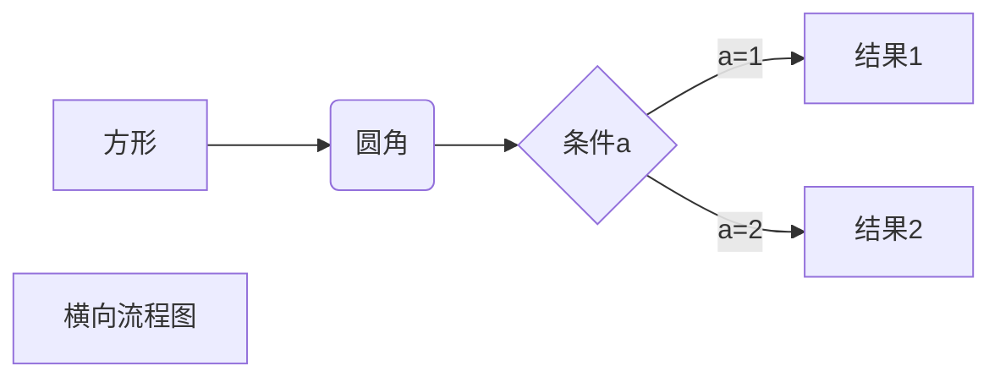
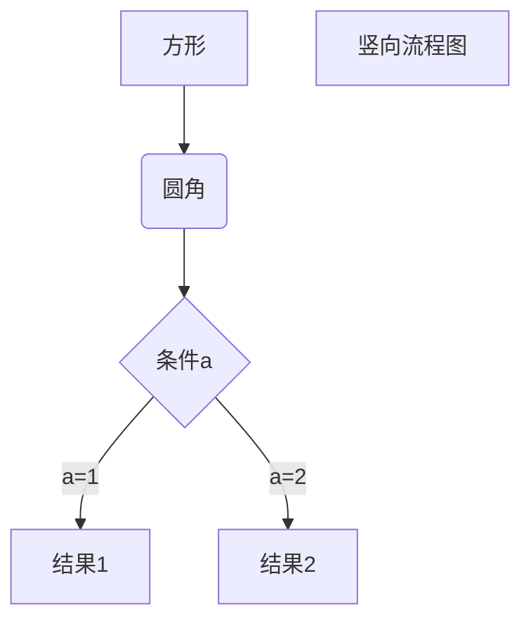
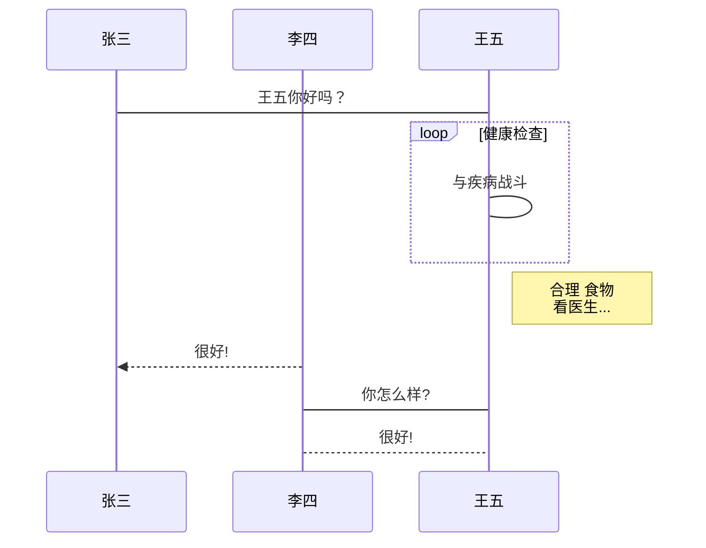
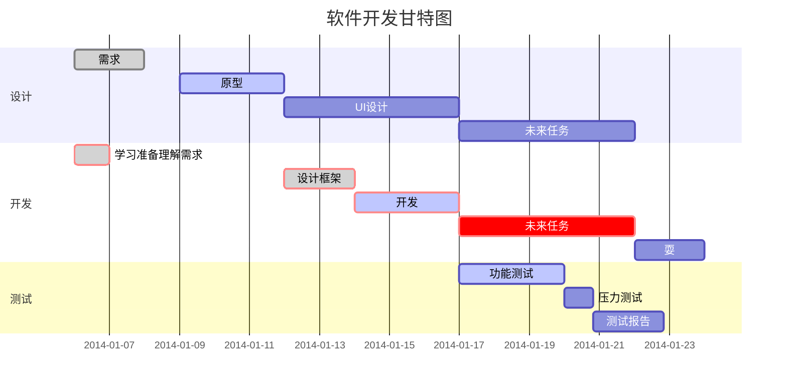

<h1>test</h1>

我展示的是一级标题
=================

我展示的是二级标题
-----------------

# 一级标题
## 二级标题
### 三级标题
#### 四级标题
##### 五级标题
###### 六级标题

*斜体文本*
_斜体文本_
**粗体文本**
__粗体文本__
***粗斜体文本***
___粗斜体文本___
~~BAIDU.COM~~
<u>带下划线文本</u>

[^脚注]脚注

***

* * *

*****

- - -

----------

* 第一项
* 第二项
* 第三项

+ 第一项
+ 第二项
+ 第三项


- 第一项
- 第二项
- 第三项

1. 第一项
2. 第二项
3. 第三项

1. 第一项：
    - 第一项嵌套的第一个元素
    - 第一项嵌套的第二个元素
2. 第二项：
    - 第二项嵌套的第一个元素
    - 第二项嵌套的第二个元素

> 最外层
> > 第一层嵌套
> > > 第二层嵌套

> 区块中使用列表
> 1. 第一项
> 2. 第二项
> + 第一项
> + 第二项
> + 第三项

* 第一项
    > 菜鸟教程
    > 学的不仅是技术更是梦想
* 第二项

>>123

>> 213

<<123
><123
<>123

`var a = 22`

```javascript
$(document).ready(function () {
    alert('RUNOOB');
});
```

[链接](https://www.baidu.com)

或者

<https://www.baidu.com>
<www.baidu.com>
<http:baidu.com>
<httpsbaidu.com>

[高级链接]: https://www.baidu.com


[1]: https://www.baidu.com/img/flexible/logo/pc/result.png

|  表头   | 表头  |
|  ----  | ----  |
| 单元格  | 单元格 |
| 单元格  | 单元格 |

| 左对齐 | 右对齐 | 居中对齐 |
| :-----| ----: | :----: |
| 单元格 | 单元格 | 单元格 |
| 单元格 | 单元格 | 单元格 |

使用 <kbd>Ctrl</kbd>+<kbd>Alt</kbd>+<kbd>Del</kbd> 重启电脑

**文本加粗** 
\*\* 正常显示星号 \*\*

```md
\   反斜线
`   反引号
*   星号
_   下划线
{}  花括号
[]  方括号
()  小括号
#   井字号
+   加号
-   减号
.   英文句点
!   感叹号
```

$$
\begin{Bmatrix}
   a & b \\
   c & d
\end{Bmatrix}
$$

$$
\begin{CD}
   A @>a>> B \\
@VbVV @AAcA \\
   C @= D
\end{CD}
$$





```flow
st=>start: 开始框
op=>operation: 处理框
cond=>condition: 判断框(是或否?)
sub1=>subroutine: 子流程
io=>inputoutput: 输入输出框
e=>end: 结束框
st->op->cond
cond(yes)->io->e
cond(no)->sub1(right)->op
```

```flow
st=>start: 开始框
op=>operation: 处理框
cond=>condition: 判断框(是或否?)
sub1=>subroutine: 子流程
io=>inputoutput: 输入输出框
e=>end: 结束框
st(right)->op(right)->cond
cond(yes)->io(bottom)->e
cond(no)->sub1(right)->op
```

```sequence
对象A->对象B: 对象B你好吗?（请求）
Note right of 对象B: 对象B的描述
Note left of 对象A: 对象A的描述(提示)
对象B-->对象A: 我很好(响应)
对象A->对象B: 你真的好吗？
```

```sequence
Title: 标题：复杂使用
对象A->对象B: 对象B你好吗?（请求）
Note right of 对象B: 对象B的描述
Note left of 对象A: 对象A的描述(提示)
对象B-->对象A: 我很好(响应)
对象B->小三: 你好吗
小三-->>对象A: 对象B找我了
对象A->对象B: 你真的好吗？
Note over 小三,对象B: 我们是朋友
participant C
Note right of C: 没人陪我玩
```





- [ ] todo list item 1
- [x] todo list item 2

123123
- 123123 <input type="checkbox" id="" disabled class="task-list-item-checkbox">

<input type="checkbox" id="" disabled="" class="task-list-item-checkbox">


<style>
h1,h2,h3,h4,h5,h6 {
    background: red;
}
</style>


<a>a</a><abbr>abbr</abbr><acronym>acronym</acronym><address>address</address><applet>applet</applet><area>area</area><article>article</article><aside>aside</aside><audio>audio</audio><b>b</b><base>base</base><basefont>basefont</basefont><bdi>bdi</bdi><bdo>bdo</bdo><big>big</big><blockquote>blockquote</blockquote><body>body</body><br>br</br><button>button</button><canvas>canvas</canvas><caption>caption</caption><center>center</center><cite>cite</cite><code>code</code><col>col</col><colgroup>colgroup</colgroup><data>data</data><datalist>datalist</datalist><dd>dd</dd><del>del</del><details>details</details><dfn>dfn</dfn><dialog>dialog</dialog><dir>dir</dir><div>div</div><dl>dl</dl><dt>dt</dt><em>em</em><embed>embed</embed><fieldset>fieldset</fieldset><figcaption>figcaption</figcaption><figure>figure</figure><font>font</font><footer>footer</footer><form>form</form><frame>frame</frame><frameset>frameset</frameset><h1>h1</h1><h2>h2</h2><h3>h3</h3><h4>h4</h4><h5>h5</h5><h6>h6</h6><head>head</head><header>header</header><hr>hr</hr><html>html</html><i>i</i><iframe>iframe</iframe>img</img><input>input</input><ins>ins</ins><kbd>kbd</kbd><label>label</label><legend>legend</legend><li>li</li><link>link</link><main>main</main><map>map</map><mark>mark</mark><menu>menu</menu><menuitem>menuitem</menuitem><meta>meta</meta><meter>meter</meter><nav>nav</nav><noframes>noframes</noframes><noscript>noscript</noscript><object>object</object><ol>ol</ol><optgroup>optgroup</optgroup><option>option</option><output>output</output><p>p</p><param>param</param><picture>picture</picture><pre>pre</pre><progress>progress</progress><q>q</q><rp>rp</rp><rt>rt</rt><ruby>ruby</ruby><s>s</s><samp>samp</samp>\x3Cscript>script\x3C/script><section>section</section><select>select</select><small>small</small><source>source</source><span>span</span><strike>strike</strike><strong>strong</strong><style>style</style><sub>sub</sub><summary>summary</summary><sup>sup</sup><svg>svg</svg><table>table</table><tbody>tbody</tbody><td>td</td><template>template</template><textarea>textarea</textarea><tfoot>tfoot</tfoot><th>th</th><thead>thead</thead><time>time</time><title>title</title><tr>tr</tr><track>track</track><tt>tt</tt><u>u</u><ul>ul</ul><var>var</var><video>video</video><wbr>wbr</wbr><xmp>xmp</xmp>
