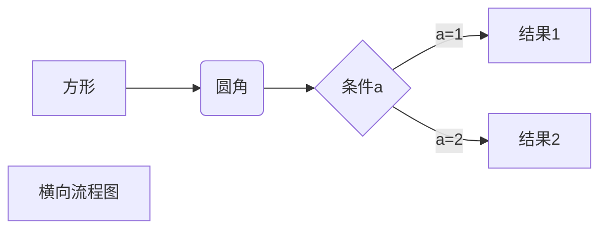
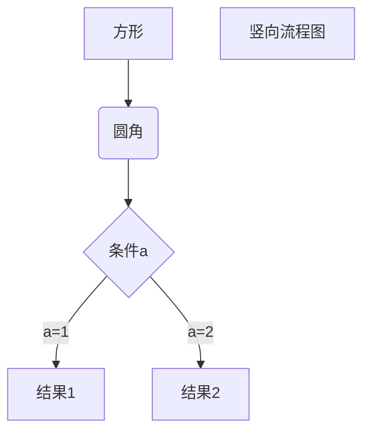
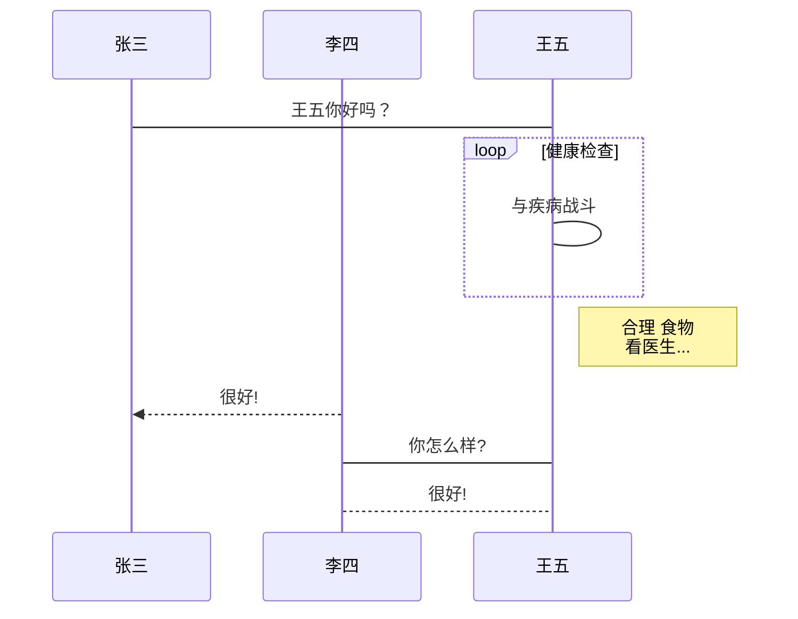
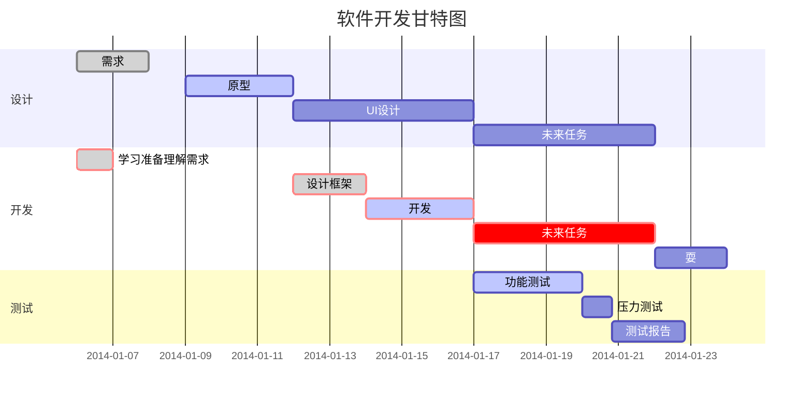

<h1>test</h1>

我展示的是一级标题
=================

我展示的是二级标题
-----------------

# 一级标题
## 二级标题
### 三级标题
#### 四级标题
##### 五级标题
###### 六级标题

*斜体文本*
_斜体文本_
**粗体文本**
__粗体文本__
***粗斜体文本***
___粗斜体文本___
~~BAIDU.COM~~
<u>带下划线文本</u>

[^脚注]脚注

***

* * *

*****

- - -

----------

* 第一项
* 第二项
* 第三项

+ 第一项
+ 第二项
+ 第三项


- 第一项
- 第二项
- 第三项

1. 第一项
2. 第二项
3. 第三项

1. 第一项：
    - 第一项嵌套的第一个元素
    - 第一项嵌套的第二个元素
2. 第二项：
    - 第二项嵌套的第一个元素
    - 第二项嵌套的第二个元素

> 最外层
> > 第一层嵌套
> > > 第二层嵌套

> 区块中使用列表
> 1. 第一项
> 2. 第二项
> + 第一项
> + 第二项
> + 第三项

* 第一项
    > 菜鸟教程
    > 学的不仅是技术更是梦想
* 第二项

`var a = 22`

```javascript
$(document).ready(function () {
    alert('RUNOOB');
});
```

[链接](https://www.baidu.com)

或者

<https://www.baidu.com>
<www.baidu.com>
<baidu.com>

[高级链接]: https://www.baidu.com


[1]: https://www.baidu.com/img/flexible/logo/pc/result.png

|  表头   | 表头  |
|  ----  | ----  |
| 单元格  | 单元格 |
| 单元格  | 单元格 |

| 左对齐 | 右对齐 | 居中对齐 |
| :-----| ----: | :----: |
| 单元格 | 单元格 | 单元格 |
| 单元格 | 单元格 | 单元格 |

使用 <kbd>Ctrl</kbd>+<kbd>Alt</kbd>+<kbd>Del</kbd> 重启电脑

**文本加粗** 
\*\* 正常显示星号 \*\*

```md
\   反斜线
`   反引号
*   星号
_   下划线
{}  花括号
[]  方括号
()  小括号
#   井字号
+   加号
-   减号
.   英文句点
!   感叹号
```

$$
\begin{Bmatrix}
   a & b \\
   c & d
\end{Bmatrix}
$$

$$
\begin{CD}
   A @>a>> B \\
@VbVV @AAcA \\
   C @= D
\end{CD}
$$





```flow
st=>start: 开始框
op=>operation: 处理框
cond=>condition: 判断框(是或否?)
sub1=>subroutine: 子流程
io=>inputoutput: 输入输出框
e=>end: 结束框
st->op->cond
cond(yes)->io->e
cond(no)->sub1(right)->op
```

```flow
st=>start: 开始框
op=>operation: 处理框
cond=>condition: 判断框(是或否?)
sub1=>subroutine: 子流程
io=>inputoutput: 输入输出框
e=>end: 结束框
st(right)->op(right)->cond
cond(yes)->io(bottom)->e
cond(no)->sub1(right)->op
```

```sequence
对象A->对象B: 对象B你好吗?（请求）
Note right of 对象B: 对象B的描述
Note left of 对象A: 对象A的描述(提示)
对象B-->对象A: 我很好(响应)
对象A->对象B: 你真的好吗？
```

```sequence
Title: 标题：复杂使用
对象A->对象B: 对象B你好吗?（请求）
Note right of 对象B: 对象B的描述
Note left of 对象A: 对象A的描述(提示)
对象B-->对象A: 我很好(响应)
对象B->小三: 你好吗
小三-->>对象A: 对象B找我了
对象A->对象B: 你真的好吗？
Note over 小三,对象B: 我们是朋友
participant C
Note right of C: 没人陪我玩
```





- [ ] todo list item 1
- [x] todo list item 2

123123
- 123123 <input type="checkbox" id="" disabled class="task-list-item-checkbox">

<input type="checkbox" id="" disabled="" class="task-list-item-checkbox">


<style>
h1,h2,h3,h4,h5,h6 {
    background: red;
}
</style>
<a>a</a>\n<abbr>abbr</abbr>\n<acronym>acronym</acronym>\n<address>address</address>\n<applet>applet</applet>\n<area>area</area>\n<article>article</article>\n<aside>aside</aside>\n<audio>audio</audio>\n<b>b</b>\n<base>base</base>\n<basefont>basefont</basefont>\n<bdi>bdi</bdi>\n<bdo>bdo</bdo>\n<big>big</big>\n<blockquote>blockquote</blockquote>\n<body>body</body>\n<br>br</br>\n<button>button</button>\n<canvas>canvas</canvas>\n<caption>caption</caption>\n<center>center</center>\n<cite>cite</cite>\n<code>code</code>\n<col>col</col>\n<colgroup>colgroup</colgroup>\n<data>data</data>\n<datalist>datalist</datalist>\n<dd>dd</dd>\n<del>del</del>\n<details>details</details>\n<dfn>dfn</dfn>\n<dialog>dialog</dialog>\n<dir>dir</dir>\n<div>div</div>\n<dl>dl</dl>\n<dt>dt</dt>\n<em>em</em>\n<embed>embed</embed>\n<fieldset>fieldset</fieldset>\n<figcaption>figcaption</figcaption>\n<figure>figure</figure>\n<font>font</font>\n<footer>footer</footer>\n<form>form</form>\n<frame>frame</frame>\n<frameset>frameset</frameset>\n<h1>h1</h1>\n<h2>h2</h2>\n<h3>h3</h3>\n<h4>h4</h4>\n<h5>h5</h5>\n<h6>h6</h6>\n<head>head</head>\n<header>header</header>\n<hr>hr</hr>\n<html>html</html>\n<i>i</i>\n<iframe>iframe</iframe>\nimg</img>\n<input>input</input>\n<ins>ins</ins>\n<kbd>kbd</kbd>\n<label>label</label>\n<legend>legend</legend>\n<li>li</li>\n<link>link</link>\n<main>main</main>\n<map>map</map>\n<mark>mark</mark>\n<menu>menu</menu>\n<menuitem>menuitem</menuitem>\n<meta>meta</meta>\n<meter>meter</meter>\n<nav>nav</nav>\n<noframes>noframes</noframes>\n<noscript>noscript</noscript>\n<object>object</object>\n<ol>ol</ol>\n<optgroup>optgroup</optgroup>\n<option>option</option>\n<output>output</output>\n<p>p</p>\n<param>param</param>\n<picture>picture</picture>\n<pre>pre</pre>\n<progress>progress</progress>\n<q>q</q>\n<rp>rp</rp>\n<rt>rt</rt>\n<ruby>ruby</ruby>\n<s>s</s>\n<samp>samp</samp>\n\x3Cscript>script\x3C/script>\n<section>section</section>\n<select>select</select>\n<small>small</small>\n<source>source</source>\n<span>span</span>\n<strike>strike</strike>\n<strong>strong</strong>\n<style>style</style>\n<sub>sub</sub>\n<summary>summary</summary>\n<sup>sup</sup>\n<svg>svg</svg>\n<table>table</table>\n<tbody>tbody</tbody>\n<td>td</td>\n<template>template</template>\n<textarea>textarea</textarea>\n<tfoot>tfoot</tfoot>\n<th>th</th>\n<thead>thead</thead>\n<time>time</time>\n<title>title</title>\n<tr>tr</tr>\n<track>track</track>\n<tt>tt</tt>\n<u>u</u>\n<ul>ul</ul>\n<var>var</var>\n<video>video</video>\n<wbr>wbr</wbr>\n<xmp>xmp</xmp>
